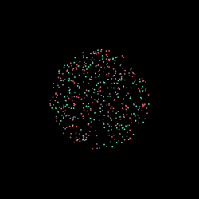
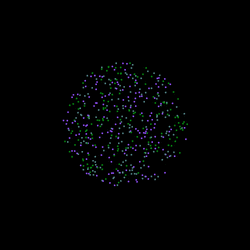
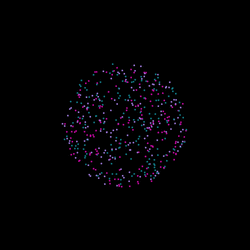
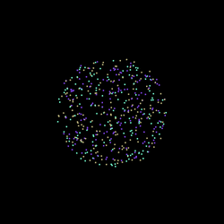

# Particles
A simple particle simulation with randomized rules.

Particles of each color move towards or away from other colors, creating unusual and almost life-like patterns.

## Previews

## Installation

### Running inside Processing IDE (all supported platforms)

Running this project inside Processing IDE allows inspecting the code and modifying the variables.

Steps:
1. Make sure you have [Processing 3.5.4 installed](https://processing.org/download). Later versions might work as well.
2. Download the source code from the [releases page](https://github.com/AugLuk/particles/releases/) or by cloning this repo.
3. Click on the file *sketch.pde* inside the *src/sketch* directory to open the project with Processing IDE.
4. Click "Run" or ctrl-R inside the IDE.

### Binary (x86-64 Windows and Linux only)

Windows only - if you don't have the Java 8 runtime installed, you can download it [here](https://www.java.com/en/download/).

Steps:
1. Go to the project's [releases page](https://github.com/AugLuk/particles/releases/) and click on the latest version.
2. Download the compressed file *particles_[version]_[platform]*.
2. Extract the files in the location of choice and double click on *sketch* (Linux) or *sketch.exe* (Windows) to run it.

## Usage

Each time the program is run, a new ruleset and new particles are randomly generated.

## Credits

Based on the video [*Particle Life - A Game of Life Made of Particles*](https://youtu.be/Z_zmZ23grXE) by [CodeParade](https://www.youtube.com/c/CodeParade).
